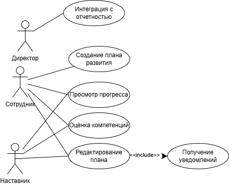

# Лабораторная работа №1
**Тема:** Формулирование требований к программной системе
**Цель работы:** Научиться анализировать поставленную задачу, формулировать функциональные и нефункциональные требования к проектируемой системе.
## Перечень заинтересованных лиц (стейкхолдеров)
- **Директор компании** - выявил необходимость в создании подобного решения, предложил проект, заинтересован в централизации управления планами развития сотрудников и повышении общей эффективности взаимодействия наставник-сотрудник
- **Наставники** - ответственны за корректировку планов развития сотрудников, предоставление обратной связи и контроль выполнения различных этапов плана
- **Сотрудники** - формируют цели, задачи по достижению целей и планы своего развития, отслеживают прогресс выполнения разных этапов плана, заинтересованы в получении обратной связи от наставников
## Перечень функциональных требований
- Сотрудники могут формулировать цели и планы развития
- Наставники и сотрудники могут редактировать планы развития, оставлять комментарии и рекомендации
- Пользователи могут получать уведомления о внесенных изменениях
- Сотрудники и наставники могут изменять компетенции в навыках
- Сотрудники и наставники могут отслеживать прогресс и метрики эффективности
- Интеграция с существующей отчетностью
## Диаграмма вариантов использования 
## Перечень сделанных предположений
- В компании 18 сотрудников, из них 1 директор и 3 наставника
- Все сотрудники имеют доступ к корпоративной системе
- Подразумевается выгрузка отчетов в виде таблиц Microsoft Excel
- Система реализуется на платформе компании
- Данные должны храниться безопасно и быть ограничены правами пользователя, сотрудник может видеть только свой план, наставник видеть только планы своих подчиненных
## Перечень нефункциональных требований
- **Производительность** - система должна обрабатывать изменения планов в течение 1-2 секунд после отправки запроса со стороны клиента
- **Безопасность** - получение данных должно быть ограничено правами пользователя
- **Удобство использования** - интерфейс должен быть понятен и удобен в использовании без необходимости полноценного обучения пользователей
- **Сопровождаемость** - решение должно поддерживаться на текущей и последующих версиях платформы компании, также должна быть оформлена соответствующая документация
- **Доступность** - приложение должны быть доступно как минимум в течение рабочего дня с учетом возможной разницы часовых поясов: с 06:00 до 20:00 по московскому времени