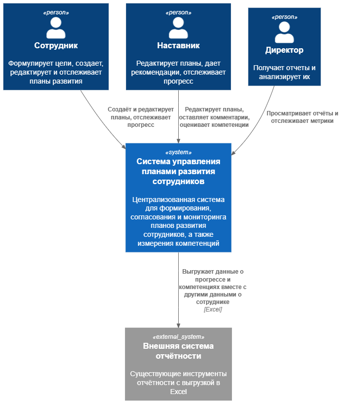
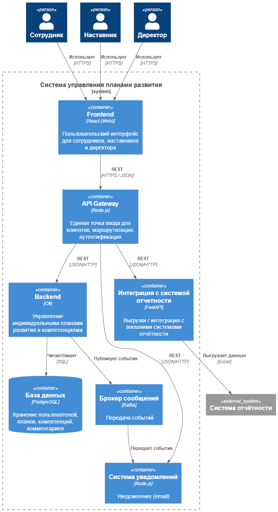
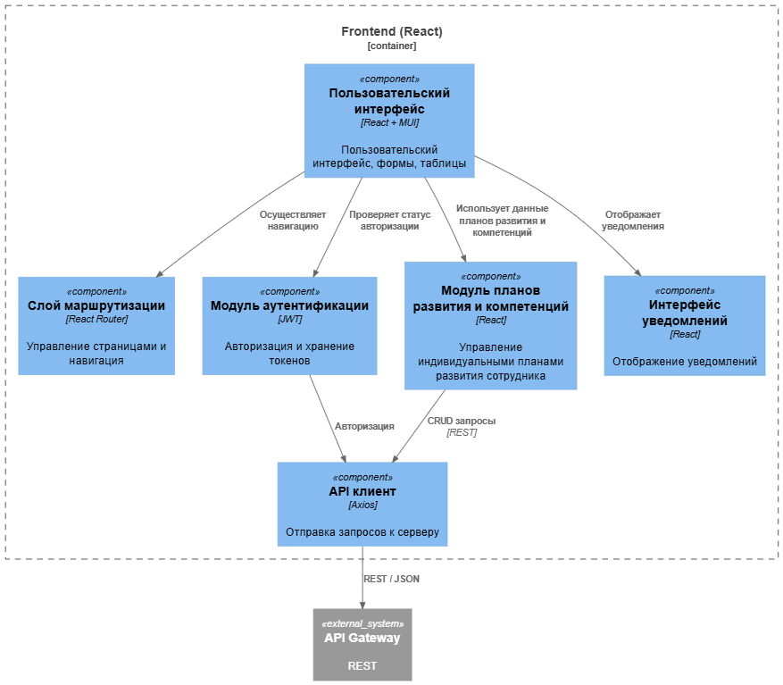
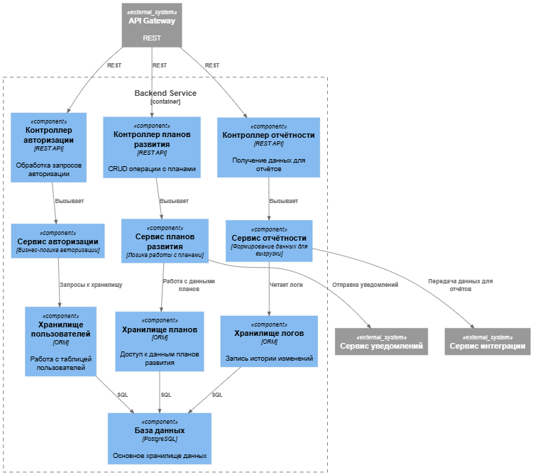

# Лабораторная работа №2
**Тема:** Использование нотации C4 model для проектирования архитектуры программной системы
**Цель работы:** Получить опыт использования графической нотации для фиксации архитектурных решений.
## Диаграмма системного контекста
Ниже на рисунке представлена диаграмма системного контекста

Основные элементы диаграммы: 
1. Акторы:
- Сотрудник
- Наставник
- Директор
2. Основная система:
- Система для управления планами развития сотрудников
3. Внешняя система:
- Система отчетности, с которой должна быть интегрирована система управления планами развития
Взаимодействие между элементами:
- Сотрудник, наставник и директор взаимодействуют с системой
- Система интегрирована с системой отчетности
## Диаграмма контейнеров
Ниже на рисунке представлена диаграмма контейнеров

Основные элементы диаграммы:
- Frontend - пользовательский интерфейс для акторов
- API Gateway - точка для входа всех клиентов, отвечает за маршрутизацию и проверку доступа
- Backend - сервис, отвечающий за обработку бизнес-логики
- Система уведомлений - отечает за отправку email-уведомлений на корпоративную электронную почту пользователей
- Сервис интеграции - отвечает за передачу данных в систему отчетности
- Брокер сообщений - передает события между сервисами
- База данных - хранит информацию о планах, компетенциях и комментариях

В качестве базового архитектурного стиля была выбран модульная распределенная архитектура, которая включает несколько сервисов и базу данных, такой выбор обсуловлен по следующим причинам:
- Более легкая интеграция новых возможностей, которые могут быть добавлены в систему в дальнейшем
- Возможность независимо развернуть отдельные модули, например, модуль уведомлений
- Масштабируемость, то есть при увеличении нагрузки можно изменять только компоненты, которые эту нагрузку испытывают в большей степени
- Простота для интеграции с существующими внешними сервисами
## Диаграмма компонентов
Ниже на рисунке представлена диаграмма компонента (Frontend)

Описание компонентов:
- Пользовательский интерфейс - отвечает за отображение данных пользователю и обработку действий на странице
- Слой маршрутизации - отвечает за переход между страницами
- Модуль аутентификации - аутентификация пользователя и хранение токена
- Модуль планов развития и компетенций - основной компонент, отвечающий бизнес-требованиям (просмотр плана, редактирование, изменение компетенций и т.д.)
- Интерфейс уведомлений - отвечает за корректное отображение сообщений на странице
- API-клиент - взаимодействие с Backend-частью
- API Gateway - точка входа в Backend-часть системы
Ниже на рисунке представлена диаграмма компонента (Backend)

Компоненты разделены на:
- Контроллеры - принимаю запросы от API Gateway
- Сервисы - отвечают за логику
- Хранилища - отвечают за доступ к БД
Данные компоненты есть для авторизации, планов развития и отчетности
Также есть внешние сервисы:
- Сервис уведомлений - отвечает за отправку email
- Сервис интеграции с системой отчетности
Последним компонентом является база данных, в которую записывается информация для работы с пользователями, управления планами и хранение логов отчетности