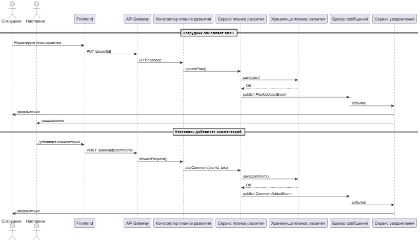
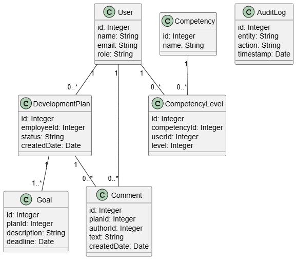

# Лабораторная работа №3
**Тема:** Использование принципов проектирования на уровне методов и классов
**Цель работы:** Получить опыт проектирования и реализации модулей с использованием принципов KISS, YAGNI, DRY, SOLID и др.
## Диаграмма контейнеров
Ниже на рисунке представлена диаграмма контейнеров

Основные элементы диаграммы:
- Frontend - пользовательский интерфейс для акторов
- API Gateway - точка для входа всех клиентов, отвечает за маршрутизацию и проверку доступа
- Backend - сервис, отвечающий за обработку бизнес-логики
- Система уведомлений - отечает за отправку email-уведомлений на корпоративную электронную почту пользователей
- Сервис интеграции - отвечает за передачу данных в систему отчетности
- Брокер сообщений - передает события между сервисами
- База данных - хранит информацию о планах, компетенциях и комментариях

В качестве базового архитектурного стиля была выбран модульная распределенная архитектура, которая включает несколько сервисов и базу данных, такой выбор обсуловлен по следующим причинам:
- Более легкая интеграция новых возможностей, которые могут быть добавлены в систему в дальнейшем
- Возможность независимо развернуть отдельные модули, например, модуль уведомлений
- Масштабируемость, то есть при увеличении нагрузки можно изменять только компоненты, которые эту нагрузку испытывают в большей степени
- Простота для интеграции с существующими внешними сервисами
## Диаграмма компонентов
Ниже на рисунке представлена диаграмма компонента (Frontend)

Описание компонентов:
- Пользовательский интерфейс - отвечает за отображение данных пользователю и обработку действий на странице
- Слой маршрутизации - отвечает за переход между страницами
- Модуль аутентификации - аутентификация пользователя и хранение токена
- Модуль планов развития и компетенций - основной компонент, отвечающий бизнес-требованиям (просмотр плана, редактирование, изменение компетенций и т.д.)
- Интерфейс уведомлений - отвечает за корректное отображение сообщений на странице
- API-клиент - взаимодействие с Backend-частью
- API Gateway - точка входа в Backend-часть системы
Ниже на рисунке представлена диаграмма компонента (Backend)

Компоненты разделены на:
- Контроллеры - принимаю запросы от API Gateway
- Сервисы - отвечают за логику
- Хранилища - отвечают за доступ к БД
Данные компоненты есть для авторизации, планов развития и отчетности
Также есть внешние сервисы:
- Сервис уведомлений - отвечает за отправку email
- Сервис интеграции с системой отчетности
Последним компонентом является база данных, в которую записывается информация для работы с пользователями, управления планами и хранение логов отчетности
## Диаграмма последовательностей
Ниже представлена диаграмма последовательности для вариантов использования: сотрудник обновляет план развития и наставник оставляет комментарий


Пользователь взаимодействует с веб-интерфейсом, который передает запрос в API Gateway, далее запрос обрабатывается контроллером и сервисом, затем выполняется сохранение данных в хранилище. Затем сервис публикует событие в брокер сообщений, которое обрабатывается сервисом уведомлений для дальнейшей рассылки уведомлений пользователям.
## Модель БД
Ниже представлена модель БД в виде диаграммы классов UML


На представленной диаграмме есть 7 сущностей:
- User - пользователь (наставник/сотрудник)
- DevelopmentPlan - план развития сотрудника
- Goal - цель по достижению плана развития
- Competency - компетенция
- CompetencyLevel - уровень компетенции
- Comment - комментарий
- AuditLog - сущность для логирования

Сущности связаны между собой, при этом связи имеют обозначения, который отражают уровень кратности.
## Применение основных принципов разработки
Ниже представлены фрагменты кода приложения (клиентской и серверной частей), которые отражают различные принципы проектирования
1. KISS
```
const updatePlan = async (id: string, data: PlanDto) => {
  return axios.put(`/api/plans/${id}`, data);
};
```
Пояснение: HTTP-запрос является простым, не содержит дополнительную логику, промежуточные слои и сложные обработчики, данная функция выполняет одну возложенную на нее функцию

2. Yagni
```
public void UpdatePlan(Guid id, UpdatePlanDto dto)
{
    var plan = repository.GetById(id);
    plan.UpdateGoals(dto.Goals);
    repository.Save(plan);
}
```

Пояснение: не реализована логика, которая не нужна в данный момент, нет тех вещей, которые и не должны быть на данном этапе (например, логика согласования), так как такие требования на данный момент отсутствуют

3. DRY
```
public interface IPlanRepository
{
    DevelopmentPlan GetById(Guid id);
    void Save(DevelopmentPlan plan);
}
```
Пояснение: работа с хранилищем вынесена в отдельный репозиторий, который в свою очередь используется сервисами, это исключает дублирование SQL-запросов и логики доступа к данным

4. SOLID
```
public class PlanService : IPlanService
{
    private readonly IPlanRepository Repository;
    private readonly IEventPublisher Publisher;

    public PlanService(IPlanRepository repository, IEventPublisher publisher)
    {
        Repository = repository;
        Publisher = publisher;
    }

    public void UpdatePlan(Guid id, UpdatePlanDto dto)
    {
        var plan = Repository.GetById(id);
        plan.UpdateGoals(dto.Goals);
        Repository.Save(plan);

        Publisher.Publish(new PlanUpdatedEvent(id));
    }
}
```
Пояснение:
- S - класс PlanService отвечает только за бизнес-логику работы с планами развития
- O - механизм событий позволяет расширить функциональны возможности без изменения кода сервиса
- L - PlanService реализует IPlanService и может быть заменен другой реализацией интерфейса
- I - сервис реализует только необходимые интерфейсы без необходимости добавлять новые методы
- D - зависимости передаются через абстракции, а не через конкретные реализации