# Лабораторная работа №4

**Тема:** Проектирование REST API

**Цель работы:** Получить опыт проектирования программного интерфейса

## Документация по API

Проектируемый API предназначается для управления планами развития сотрудников в компании.
Основные возможности:

- создание и просмотр планов развития;
- управление и отслеживание целей по достижению планов;
- комментирование и редактирование планов;
- интеграция с системой отчетности.

Принятые в ходе проектирования решения:

- Использование REST в качестве архитектурного решения и его основных принципов (клиент-сервер, stateless, единообразие интерфейсов и т.д.)
- Использование HTTP-методов:
  - GET - получение данных
  - PUT - обновление данных
  - DELETE - удаление данных
  - POST - добавление данных
- Использование JSON в качестве формата для обмена данными
- Идентификация ресурсов через URL (каждая сущность однозначно идентифицируется через URL)
- Явное использование HTTP-кодов ответа для взаимодействия с API:
  - 200 - успешно
  - 400 - ошибка запроса
  - 404 - ресурс не найден
  - 201 - ресурс создан
- Соответствие принципам KISS, YAGNI: реализация только необходимых для бизнес-требований методов
- Возможность расширения API без изменения текущих решений
- Разделение ответственности между слоями: контроллеры API не содержат логики, которая вынесена на слой сервисов

#### Метод GET:

1. endpoint: GET /api/plans
2. Описание: используется для получение всех планов развития сотрудников
3. Параметры: -
4. Успешное выполение (200 OK):

```
[
  {
    "id": "1",
    "employeeId": "12",
    "title": "Управление планом развития сотрудника Иванова на 2025 год",
    "status": "Closed"
  }
  {
    "id": "2",
    "employeeId": "12",
    "title": "Управление планом развития сотрудника Иванова на 2026 год",
    "status": "InProgress"
  }
]
```

#### Метод GET (по id):

1. endpoint: GET /api/plans/{id}
2. Описание: используется для получение конкретного плана по идентификатору
3. Параметры:

| Параметр | Тип     | Описание                     |
| -------- | ------- | ---------------------------- |
| id       | integer | Идентификатор плана развития |

4. Успешное выполение (200 OK):

```
{
  "id": "2",
  "employeeId": "12",
  "title": "Управление планом развития сотрудника Иванова на 2026 год",
  "status": "InProgress"
}
```

#### Метод POST:

1. endpoint: POST /api/plans
2. Описание: используется для создания плана по параметрам
3. Параметры:

| Параметр   | Тип     | Описание                 |
| ---------- | ------- | ------------------------ |
| employeeId | integer | Идентификатор сотрудника |
| title      | string  | Описание плана           |
| status     | string  | Статус плана             |

Тело запроса

```
{
  "employeeId": "13",
  "title": "Управление планом развития сотрудника Сидорова на 2026 год",
  "status": "Open"
}
```

4. Успешное выполение (201 Created):

```
{
  "id": "3",
  "employeeId": "13",
  "title": "Управление планом развития сотрудника Сидорова на 2026 год",
  "status": "Open"
}
```

#### Метод PUT:

1. endpoint: PUT /api/plans/{id}
2. Описание: используется для изменения плана развития
3. Параметры:

| Параметр   | Тип     | Описание                 |
| ---------- | ------- | ------------------------ |
| employeeId | integer | Идентификатор сотрудника |
| title      | string  | Описание плана           |
| status     | string  | Статус плана             |

Тело запроса

```
{
  "employeeId": "14",
  "title": "Управление планом развития сотрудника Мухина на 2026 год",
  "status": "InProgress"
}
```

4. Успешное выполение (200 OK):

```
{
  "id": "3",
  "employeeId": "14",
  "title": "Управление планом развития сотрудника Мухина на 2026 год",
  "status": "InProgress"
}
```

#### Метод DELETE:

1. endpoint: DELETE /api/plans/{id}
2. Описание: используется для удаления плана развития
3. Параметры:

| Параметр | Тип     | Описание                     |
| -------- | ------- | ---------------------------- |
| id       | integer | Идентификатор плана развития |

4. Успешное выполение (200 OK):

```
{
  "message": "План успешно удален"
}
```

Ц

#### Метод GET (по ID):

1. endpoint: GET /api/plans/{planId}/goals
2. Описание: используется всех целей конкретного плана
3. Параметры:

| Параметр | Тип     | Описание                     |
| -------- | ------- | ---------------------------- |
| planId   | integer | Идентификатор плана развития |

4. Успешное выполение (200 OK):

```
[
  {
    "id": "1",
    "planId": "2",
    "description": "Изучить основы GIT",
    "deadline": "2026-03-01"
  },
  {
    "id": "2",
    "planId": "2",
    "description": "Получить сертификат Java",
    "deadline": "2026-06-01"
  }
]
```

### Реализация API и тестирование

#### API

API реализовано с помощью фреймворка FastAPI на языке программирования python. Реализованы методы GET, PUT, POST, DELETE

Кратко о каждом реализованном endpoint'е

| Endpoint                   | Метод  | Описание                               |
| -------------------------- | ------ | -------------------------------------- |
| /api/plans                 | GET    | Получение всех планов развития         |
| /api/plans/{plan_id}       | GET    | Получение конкретного плана по ID      |
| /api/plans                 | POST   | Создание нового плана                  |
| /api/plans/{plan_id}       | PUT    | Обновление существующего плана         |
| /api/plans/{plan_id}       | DELETE | Удаление плана                         |
| /api/plans/{plan_id}/goals | GET    | Получение всех целей конкретного плана |

#### Тестирование в Postman

#### Метод GET

* Строка запроса: GET http://127.0.0.1:8000/api/plans
* Заголовки и парметры: -
* Полученный ответ: 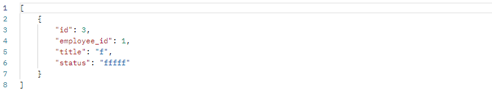 
* Коды автотестов: 

```
pm.test("Response status code is 200", function () {
  pm.response.to.have.status(200);
});

pm.test("Response is an array", function () {
  pm.expect(pm.response.json()).to.be.an('array');
});
```
* Результаты тестирования:
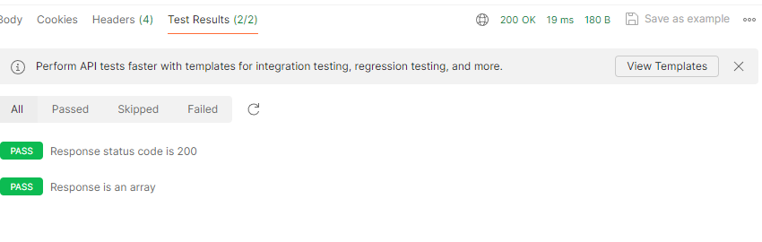

#### Метод GET (по id)

* Строка запроса: GET http://127.0.0.1:8000/api/plans/3
* Заголовки и парметры: -
* Полученный ответ: 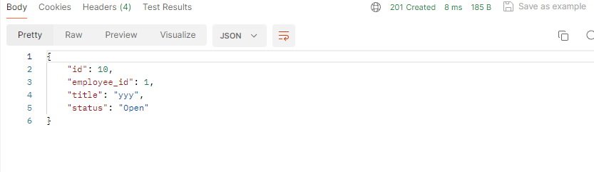
* Коды автотестов: 

```
pm.test("Response status code is 200", function () {
  pm.response.to.have.status(200);
});

pm.test("Response contains required fields", function () {
  const responseData = pm.response.json();
  pm.expect(responseData).to.have.all.keys('id', 'employee_id', 'title', 'status');
});

```
* Результаты тестирования:
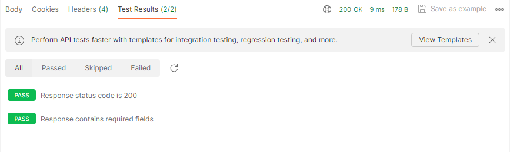

#### Метод POST

* Строка запроса: POST http://127.0.0.1:8000/api/plans
* Заголовки и парметры: 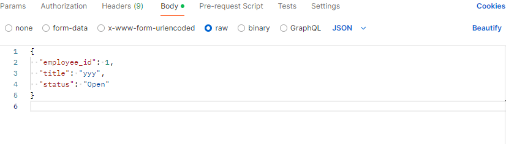
* Полученный ответ: 
* Коды автотестов: 

```
pm.test("Status code is 201", function () {
    pm.response.to.have.status(201);
});

pm.test("Created plan data is valid", function () {
    const responseData = pm.response.json();
    pm.expect(responseData).to.have.property('id');
    pm.expect(responseData).to.have.property('employee_id');
    pm.expect(responseData).to.have.property('title');
    pm.expect(responseData).to.have.property('status');
});

```
* Результаты тестирования:
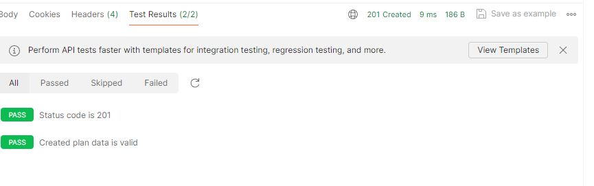

#### Метод PUT

* Строка запроса: PUT http://127.0.0.1:8000/api/plans/11
* Заголовки и парметры: 
* Полученный ответ: 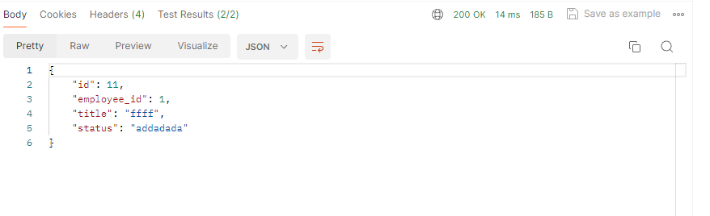
* Коды автотестов: 

```
pm.test("Response status code is 200", function () {
  pm.response.to.have.status(200);
});

pm.test("Plan was updated", function () {
  const responseData = pm.response.json();
  pm.expect(responseData).to.have.property('id').that.is.not.equal(0);
  pm.expect(responseData).to.have.property('employee_id').that.is.not.equal(0);
  pm.expect(responseData).to.have.property('title').that.is.not.empty;
  pm.expect(responseData).to.have.property('status').that.is.not.empty;
});

```
* Результаты тестирования:
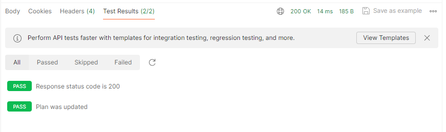

#### Метод DELETE

* Строка запроса: DELETE http://127.0.0.1:8000/api/plans/11
* Заголовки и парметры: -
* Полученный ответ: 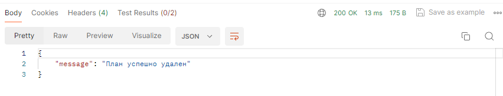
* Коды автотестов: 

```
pm.test("Response status code is 200", function () {
  pm.expect(pm.response.code).to.equal(200);
});


pm.test("Delete message is correct", function () {
    pm.expect(pm.response.json().message).to.eql("План успешно удален");
});

```
* Результаты тестирования:
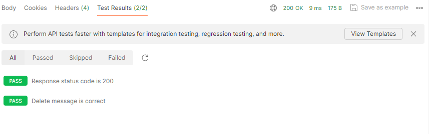

#### Метод GET (по id)

* Строка запроса: GET http://127.0.0.1:8000/api/plans/3/goals
* Заголовки и парметры: -
* Полученный ответ: 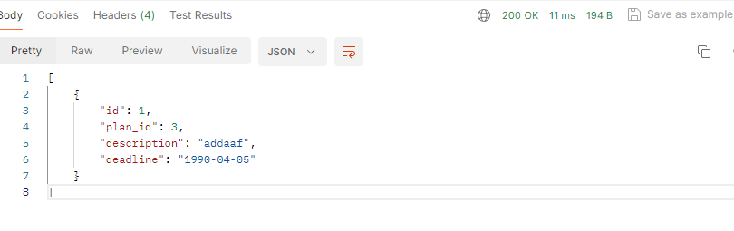
* Коды автотестов: 

```
pm.test("Status code is 200", function () {
    pm.response.to.have.status(200);
});

pm.test("Response is array of goals", function () {
    const jsonData = pm.response.json();
    pm.expect(jsonData).to.be.an("array");
});
```
* Результаты тестирования:
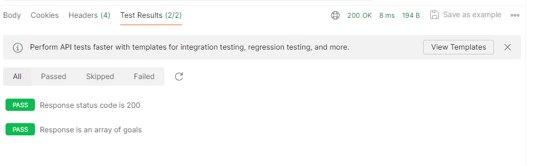