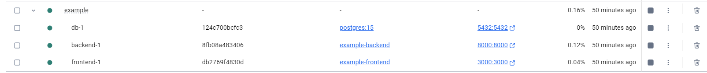
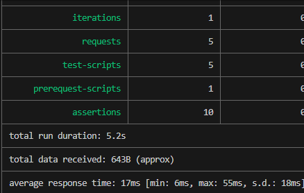

# Лабораторная работа №5

**Тема:** Реализация архитектуры на основе сервисов (микросервисной архитектуры)

**Цель работы:** Получить опыт работы организации взаимодействия сервисов с использованием контейнеров Docker

## Контейнеры

Были созданы backend, frontend и БД для демонстрации, далее были созданы Dockerfile для клиентской и серверной частей

Dockerfile для клиентской части

```
FROM node:18

WORKDIR /app

COPY package*.json ./
RUN npm install

COPY . .

CMD ["npm", "start"]
```

Dockerfile для серверной части

```
FROM python:3.11

WORKDIR /app

COPY requirements.txt .
RUN pip install --no-cache-dir -r requirements.txt

COPY . .

CMD ["sh", "-c", "sleep 5 && uvicorn main:app --host 0.0.0.0 --port 8000"]
```

Далее был реализован файл docker-compose.yml

Содержимое файла представлено ниже

```
version: "3.9"

services:
  frontend:
    build: ./frontend
    ports:
      - "3000:3000"
    depends_on:
      - backend

  backend:
    build: ./backend
    ports:
      - "8000:8000"
    environment:
      DATABASE_URL: postgresql://postgres:postgres@db:5432/arch
    depends_on:
      - db

  db:
    image: postgres:15
    environment:
      POSTGRES_DB: arch
      POSTGRES_USER: postgres
      POSTGRES_PASSWORD: postgres
    ports:
      - "5432:5432"

  tests:
    image: postman/newman
    depends_on:
      - backend
    volumes:
      - ./postman_collection.json:/etc/newman/collection.json
    command: run /etc/newman/collection.json --delay-request 1000
```

Затем с помощью команды docker-compose up --build были запущены контейнеры
## Интеграционные тесты

Тестирование был осущствлено с помощью тестов, которые были описаны в предыдущей части работы, с помощью файла postman_collection.json и файла docker-compose.yml была создана система интеграционных тестов

Результат тестирования:

